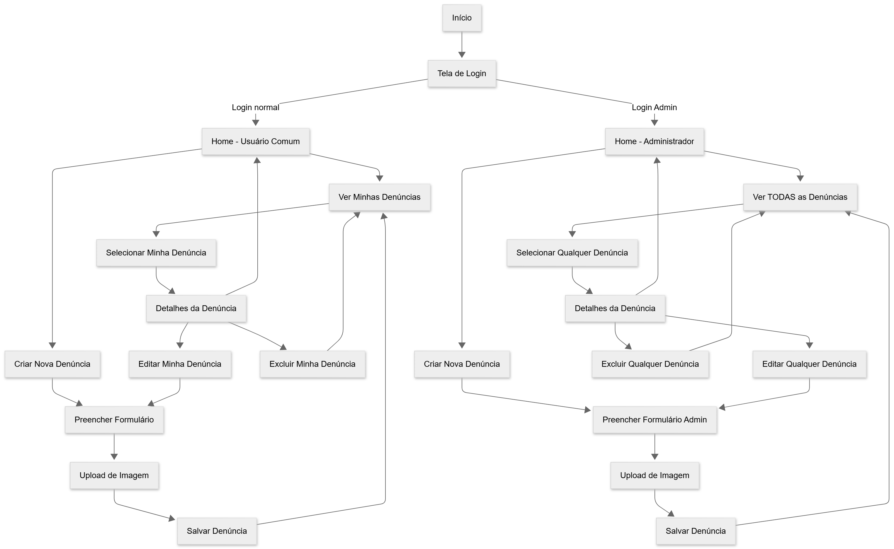
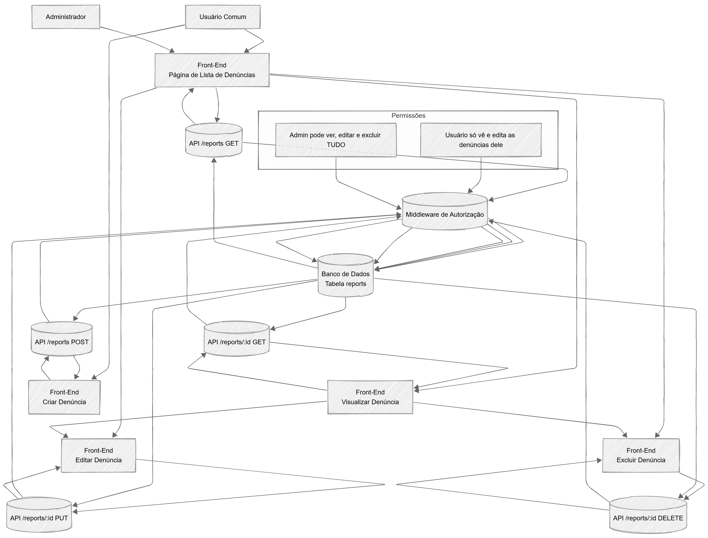

# 🧠 denuncIA-app — Sistema de Denúncias

## 📌 Descrição do Projeto

### Introdução

- **Nome do projeto:** *denuncIA-app*  
- **Contexto:** Projeto em desenvolvimento (branch `dev`), conectando um **frontend moderno** com **backend Django** para registro, listagem e gerenciamento de denúncias.  
- **Objetivo:** Criar uma aplicação full-stack onde usuários enviam denúncias e o backend gerencia, armazena e controla permissões (usuário comum × administrador).  
- **Motivações:**
  - Praticar integração **React/TSX + Django REST**  
  - Criar um sistema real com fluxo completo (CRUD + permissões)  
  - Fortalecer portfólio com um projeto full-stack  

---

## ⚙️ Principais Funcionalidades do Projeto

### 🔹 Frontend (React / JavaScript / TypeScript)
- Interface completa para denúncias  
- Formulários para criação e edição  
- Listagem reativa  
- Restrição de edição e exclusão conforme o papel do usuário  
- Componentes reutilizáveis  

### 🔹 Backend (Django + Django REST Framework)
- API REST para CRUD de denúncias  
- Modelos representando denúncias, usuários e permissões  
- Autenticação e autorização (em expansão)  
- Middleware para diferenciar **ADM** e **USER**  

### 🔹 Integração Front–Back
- Comunicação via chamadas HTTP (fetch/axios)  
- Front rodando com `npm run dev`  
- Backend rodando em Django simultaneamente  

---

## 🛠️ Tecnologias Utilizadas

- **Python + Django**  
- **Django REST Framework**  
- **JavaScript / TypeScript**  
- **React**  
- **npm**  
- **Git / GitHub**  

---

## 🔄 Fluxos do Sistema

### 📥 **UserFlow — Fluxo do Usuário**
Representa o caminho entre:  
Login → Criar Denúncia → Listar → Editar/Excluir → Papel de ADM × Usuário.



---

### 🔁 **DataFlow — Fluxo de Dados (ADM × Usuário)**
Mostra o trânsito de dados entre:  
Front-end ↔ API ↔ Middleware de Permissões ↔ Banco de Dados.

Inclui:
- Usuário só vê/edita/exclui **denúncias próprias**  
- ADM vê, edita e exclui **todas**  



---

## 🖼️ Capturas de Tela

*O projeto está em desenvolvimento contínuo. As telas exibem:*  
- Formulário de denúncias  
- Lista com ícones, botões de editar/excluir  
- Layout inspirado em sites governamentais  

---

## 📚 Lições Aprendidas

- Estruturação de projeto **full-stack desacoplado**  
- Fluxo completo **Frontend ↔ Backend Django REST**  
- Boas práticas de comunicação entre serviços  
- Modelagem de dados e permissões avançadas  
- Gerenciamento de estado e formulários no front  

---

## 🔍 Funcionalidades em Desenvolvimento

- Autenticação (login, roles ADM/USER)  
- Filtro de denúncias  
- Painel administrativo  
- Notificações em tempo real  
- Dashboard futuro  

---

## ✨ Próximos Passos

- Versionamento da API  
- Deploy (Vercel + Railway / Render / DigitalOcean)  

---

## 🚀 Como rodar localmente

### 1. Clone o repositório  
```bash
git clone https://github.com/leonard0antonio/denuncIA-app.git
````

---

### 2. Backend (Django)

```bash
cd backend
pip install -r requirements.txt
python manage.py migrate
python manage.py runserver
```

---

### 3. Frontend (React)

```bash
cd frontend
npm install
npm run dev
```

---

### 4. Acessos

* Frontend: **[http://localhost:3000](http://localhost:3000)**
* Backend: **[http://localhost:8000](http://localhost:8000)**

---

## 🏁 Final

Este projeto está evoluindo para uma solução completa de denúncias, com foco em usabilidade, segurança, fluxo realista e arquitetura profissional.
Sinta-se à vontade para contribuir, abrir issues ou sugerir melhorias!

```
